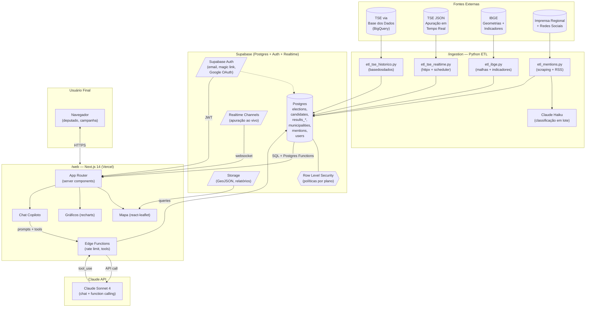

# Arquitetura — elleito.ai

Este documento descreve a arquitetura técnica do elleito.ai: como os componentes se conectam, fluxos de dados e decisões de design relevantes.

## Visão Geral

O elleito.ai é um sistema de três camadas lógicas:

1. **Camada de Ingestão (batch)** — Python ETL que popula e mantém o Postgres com dados do TSE, IBGE e menções
2. **Camada de Dados (Supabase)** — Postgres como fonte única da verdade, com Auth, Realtime e Storage
3. **Camada de Apresentação (Next.js)** — Frontend web com dashboard e chat copiloto, consumindo diretamente o Supabase e chamando a Claude API

## Diagrama de Componentes



## Fluxos de Dados Principais

### Fluxo 1: Carga Histórica (executado 1x + atualizações anuais)

```
Base dos Dados (BigQuery) → etl_tse_historico.py
  → normalização (pandas)
  → validação (pandera/schema)
  → upsert em Postgres (via supabase-py)
  → checks pós-carga (contagens, FK)
```

### Fluxo 2: Apuração em Tempo Real (dia da eleição)

```
Scheduler (cron a cada 60s) → etl_tse_realtime.py
  → fetch TSE JSON público
  → diff com último estado
  → upsert incremental em results_municipality/results_zone
  → Postgres notifica via Realtime
  → Frontend (Next.js) atualiza mapa via subscription
```

### Fluxo 3: Pergunta no Chat Copiloto

```
Usuário digita pergunta → POST /api/chat (Next.js)
  → Edge Function valida cota + RLS do usuário
  → envia para Claude API com system prompt + tools disponíveis
  → Claude decide: tool_use (ex.: query_results)
  → Edge executa query Postgres com JWT do usuário
  → resultado volta para Claude para síntese final
  → resposta + visualizações renderizadas no chat
```

### Fluxo 4: Coleta e Classificação de Menções

```
Cron diário → etl_mentions.py
  → coleta de veículos (RSS + scraping ético)
  → deduplicação por URL + hash
  → batch de classificação em Claude Haiku
     (sentimento, entidades, tópicos)
  → persistência em tabela mentions
  → índice full-text (PT-BR) para busca
```

## Decisões de Arquitetura

### Por que Supabase?

- **Postgres real**: sem abstração proprietária; podemos sair se necessário
- **Auth pronto**: JWT, OAuth, magic link, MFA — sem reinventar a roda
- **Realtime embutido**: fundamental para apuração em tempo real
- **RLS nativo**: controle de permissão por linha via policies SQL
- **Custo previsível**: plano Pro suporta o MVP confortavelmente

### Por que Next.js 14 App Router?

- **Server Components** reduzem JS no cliente (dashboards são pesados)
- **Streaming** melhora TTI para páginas com mapas
- **Deployment Vercel** tem edge functions nativas próximas do usuário BR
- **Ecossistema**: shadcn/ui, Tailwind e TypeScript são padrão de mercado

### Por que Python para ETL?

- **basedosdados** é biblioteca oficial Python para acessar o BD do BR
- **pandas** é ferramenta incontornável para limpeza tabular
- Separação clara: Node/TS no user-facing, Python no data-facing
- Facilita contratar cientistas de dados depois

### Por que Claude (Sonnet + Haiku)?

- **Sonnet 4**: excelente em function calling, raciocínio sobre dados tabulares e português
- **Haiku**: custo/performance ideal para classificação em lote (menções)
- **Escolha dupla**: otimiza custo sem perder qualidade nas conversas

## Segurança

### Autenticação e Autorização

- Supabase Auth como IdP único
- JWT de curta duração (1h) + refresh token
- Planos de assinatura refletidos em `users.plan`
- **RLS** aplicado em todas as tabelas user-facing

### Proteção da Claude API

- Chave da Claude API **nunca** exposta ao cliente
- Todas as chamadas via Edge Function autenticada
- Rate limiting por `user_id` via Supabase (tabela `chat_usage`)
- Log completo de prompts/respostas para auditoria e revisão de custos

### Dados Sensíveis

- LGPD: tabela `users` contém dados pessoais, protegida por RLS
- Menções coletadas são **dados públicos** — mas armazenadas com referência ao autor para respeitar eventual direito ao esquecimento
- Auditoria: tabela `audit_log` registra ações administrativas

## Observabilidade

- **Logs**: Vercel Logs (web) + Supabase Logs (DB) + Python logging (ETL)
- **Métricas de produto**: PostHog (eventos de uso, funis)
- **Métricas de IA**: tabela `chat_usage` com tokens, latência, custo por chamada
- **Alertas**: ETL falhou, custo LLM acima do orçamento, erro HTTP 5xx > 1%

## Escalabilidade

O MVP foi dimensionado para **suportar até 500 usuários simultâneos** sem ajustes:

- Supabase Pro: 8GB RAM, 2 vCPUs — suficiente para 399 municípios × milhares de candidatos
- Vercel: escala automaticamente (serverless)
- Claude API: sem limite prático exceto cota da conta

Além desse volume, planejamos:
- **Read replicas** do Postgres para queries analíticas pesadas
- **Cache** (Redis/Upstash) para respostas de queries frequentes
- **CDN** para geometrias GeoJSON (já são estáticas)

## Ambientes

| Ambiente | Uso | URL prevista |
|----------|-----|---------------|
| `local` | Dev em `localhost` | — |
| `dev` | Instância Supabase + Vercel Preview | `dev.elleito.ai` |
| `staging` | Pré-produção, dados reais | `staging.elleito.ai` |
| `prod` | Cliente final | `app.elleito.ai` |

Cada ambiente tem seu próprio projeto Supabase — sem compartilhamento de banco.
