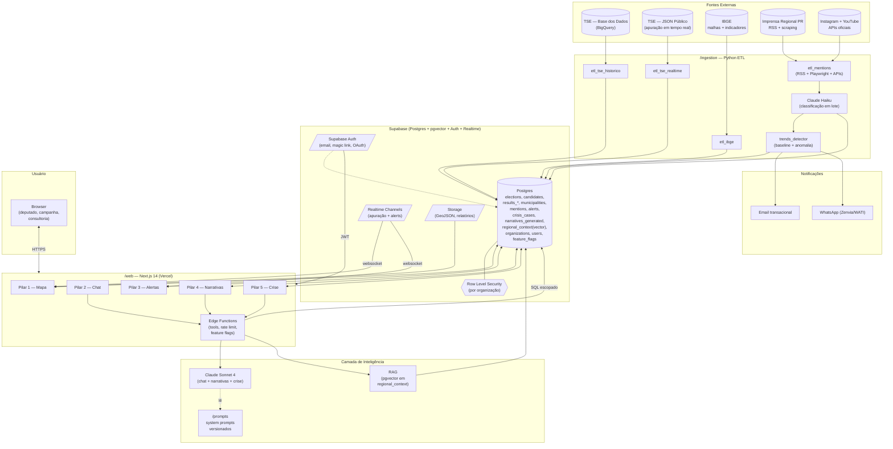

# Arquitetura — elleito.ai

Este documento descreve a arquitetura técnica do elleito.ai: como os cinco pilares do produto (ver [PROJECT.md](./PROJECT.md)) se materializam em componentes e como os dados fluem entre eles.

## Visão Geral

O sistema tem **quatro camadas lógicas**:

1. **Ingestão (batch + scheduled)** — Python ETL que popula e atualiza o Postgres com TSE, IBGE, menções de imprensa e redes sociais
2. **Dados (Supabase)** — Postgres + pgvector como fonte única da verdade; Auth, Realtime e Storage no mesmo pacote
3. **Inteligência (Claude API + Edge Functions)** — orquestração de prompts, function calling, RAG de contexto regional, classificação em lote
4. **Apresentação (Next.js)** — dashboard, chat copiloto, fluxos guiados de narrativa e crise

Cada pilar se apoia em um subconjunto dessas camadas, mas todos compartilham o mesmo banco — é a sinergia entre pilares que gera valor.

## Diagrama de Componentes (5 pilares)



## Mapeamento Pilar ↔ Componentes

| Pilar | Superfície | Backend | IA / Dados |
|-------|-----------|---------|------------|
| **1 — Dashboard** | `PAGE_MAP` | Postgres, Realtime, Storage | Nenhuma (dados puros) |
| **2 — Chat Copiloto** | `PAGE_CHAT` | Edge Functions, Postgres | Claude Sonnet + **RAG** sobre `regional_context` |
| **3 — Tendências** | `PAGE_ALERTS` | `trends_detector` (cron), `alerts`, notificações | Claude Sonnet (análise do alerta); Haiku (classificação em lote) |
| **4 — Narrativas** | `PAGE_NARR` | Edge Functions, `narratives_generated` | Claude Sonnet + RAG sobre casos anteriores |
| **5 — Crise** | `PAGE_CRISIS` | Edge Functions, `crisis_cases` | Claude Sonnet + RAG sobre casos anteriores |

## Fluxos de Dados Principais

### Fluxo 1 — Carga Histórica TSE (1x + atualização anual)

```
Base dos Dados (BigQuery) → etl_tse_historico.py
  → normalização (pandas, mappings canônicos)
  → validação (pydantic, dedup)
  → UPSERT em Postgres (candidates, results_municipality, results_zone)
  → checks pós-carga (contagens, FK)
```

### Fluxo 2 — Apuração em Tempo Real (D-day)

```
Scheduler (cada 60s) → etl_tse_realtime.py
  → fetch TSE JSON público
  → diff com último estado
  → UPSERT incremental em results_*
  → Postgres Realtime notifica clientes conectados
  → PAGE_MAP atualiza mapa via subscription
```

### Fluxo 3 — Pergunta no Chat (Pilar 2)

```
Usuário → POST /api/chat (Edge Function)
  1. Valida feature flag "chat_copilot" e quota da organização
  2. Busca contexto regional (RAG): pgvector sim. similarity sobre regional_context
  3. Monta system prompt versionado (/prompts/chat/<versão>.md)
  4. Chama Claude Sonnet com tools (query_results, get_municipality_profile, ...)
  5. Sonnet pode emitir tool_use → Edge executa SQL escopado
  6. Resposta final volta, renderização rica (tabelas/gráficos/mapas) no chat
  7. Persiste em chat_conversations / chat_messages
  8. Registra tokens/custo/latência
```

### Fluxo 4 — Coleta + Classificação de Menções (Pilar 3/4/5 dependem disto)

```
Cron diário → etl_mentions.py
  → coletores: RSS + Playwright + Instagram Graph + YouTube Data
  → deduplicação (URL canônica + hash conteúdo)
  → classificação em Claude Haiku (sentimento, entidades, tópicos)
  → persistência em mentions + índice full-text PT-BR
```

### Fluxo 5 — Detecção de Tendência + Alerta (Pilar 3)

```
Job recorrente → trends_detector
  1. Para cada (tópico × região): calcula baseline (média móvel 30d)
  2. Janela atual (24–48h): se volume > 150% baseline → dispara
  3. Análise do alerta via Sonnet: sentimento, atores, canais, projeção
  4. INSERT em alerts + envio de notificação (email/WhatsApp/in-app)
  5. Realtime atualiza PAGE_ALERTS para organizações afetadas
```

### Fluxo 6 — Geração de Narrativa (Pilar 4)

```
Usuário preenche formulário estruturado → Edge Function
  → RAG: busca casos históricos comparáveis em narratives_generated + crisis_cases
  → Sonnet com prompt /prompts/narratives/<versão>.md
  → Retorna 3 narrativas + recomendação + riscos
  → Persiste em narratives_generated (input, output)
  → Usuário pode depois marcar "ação tomada" + "resultado"
```

### Fluxo 7 — Análise de Crise (Pilar 5)

```
Usuário inicia fluxo guiado → input estruturado (6 campos)
  → Edge Function chama Sonnet com prompt /prompts/crisis/<versão>.md
  → Diagnóstico: gravidade, vetor, janela de ação
  → 3 cenários de resposta + roteiros + canais + timing
  → Recomendação final + plano 72h
  → Persiste em crisis_cases (organização + input + output + ações subsequentes)
```

## Decisões de Arquitetura

### Por que Supabase + pgvector?

- **Postgres real**, sem abstração proprietária — podemos sair sem rewrite
- **Auth pronto** (OAuth, magic link, MFA)
- **Realtime nativo** para apuração ao vivo e alertas push
- **pgvector** permite RAG sem precisar de banco vetorial separado
- **RLS nativo** para gating por organização

### Por que Claude (Sonnet 4 + Haiku)?

- **Sonnet 4**: excelente em function calling, raciocínio sobre dados tabulares, prompts longos em português
- **Haiku**: ~15× mais barato para classificação em lote (menções) sem perder qualidade para a tarefa
- Escolha dupla **otimiza custo** sem sacrificar chat/narrativas

### Por que Next.js 14 + Vercel?

- **Server Components** reduzem JS no cliente (dashboards são pesados)
- **Edge Functions** próximas do usuário BR
- **Streaming** melhora TTI com mapas grandes

### Por que Python + Railway/Render para ingestão?

- `basedosdados`, `pandas`, `playwright` — stack Python é imbatível para ETL
- Jobs longos (coleta de imprensa com scraping JS) não encaixam bem em Edge Functions
- **Railway/Render** com scheduled jobs é simples e barato

### Por que `/prompts` como código versionado?

Ver [docs/PROMPTS_STRATEGY.md](./docs/PROMPTS_STRATEGY.md). Em produtos de IA estratégica, **a qualidade do prompt é o produto**. Tratar prompts como strings soltas é garantia de regressão silenciosa.

## Segurança

### Autenticação e Autorização
- Supabase Auth como IdP único; JWT curto (1h) + refresh token
- **Organização** é a unidade de isolamento (ADR-003). RLS restringe dados de conta por `organization_id`.
- Dados eleitorais públicos (TSE/IBGE) são **abertos a qualquer autenticado**

### Proteção da Claude API
- Chave Anthropic **nunca** exposta no cliente; todas as chamadas via Edge Function autenticada
- Rate limiting por organização (feature flag `limits.monthly_queries`)
- Log completo de prompts/respostas para auditoria e revisão de custos

### Dados Pessoais
- **LGPD:** `users` tem dados pessoais mínimos, protegido por RLS
- **ADR-002:** candidatos **não** têm CPF, bens, nascimento, endereço, escolaridade ou ocupação armazenados
- Menções são dados públicos; autor referenciado para respeitar direito ao esquecimento

## Observabilidade

| Camada | Ferramenta |
|--------|------------|
| Erros (web + edge) | **Sentry** |
| Analytics de produto | **PostHog** (funis, retenção) |
| Logs de backend | **Supabase Logs** |
| Métricas de IA | Tabela `chat_usage` (tokens, latência, custo por org) |
| Alertas operacionais | ETL quebrou, custo LLM acima do budget diário, erro HTTP 5xx > 1% |

## Escalabilidade

MVP dimensionado para **~500 usuários simultâneos** sem ajustes:

- Supabase Pro: 8GB RAM, 2 vCPUs — suficiente para 399 municípios × milhares de candidatos
- Vercel: escala automaticamente
- Claude API: sem limite prático exceto cota da conta

Se extrapolar:
- **Read replicas** do Postgres para queries analíticas
- **Cache** (Upstash Redis) para respostas frequentes do chat
- **CDN** para GeoJSON (já é estático)

## Ambientes

| Ambiente | Uso | URL |
|----------|-----|-----|
| `local` | Dev | `localhost` |
| `dev` | Supabase + Vercel Preview | `dev.elleito.ai` |
| `staging` | Pré-produção, dados reais | `staging.elleito.ai` |
| `prod` | Cliente final | `app.elleito.ai` |

Cada ambiente tem seu próprio projeto Supabase — sem compartilhamento de banco.
