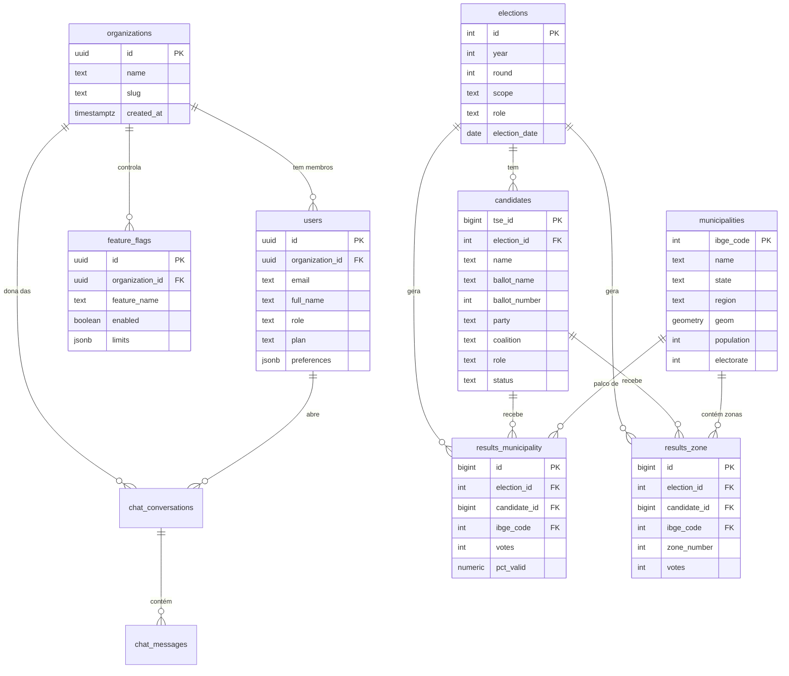

# Data Model — elleito.ai

Este documento descreve o schema Postgres (Supabase) do elleito.ai. Ele é a **fonte da verdade** do modelo de dados e deve estar sempre sincronizado com as migrations em `/supabase/migrations/`.

> Este schema reflete as decisões **[ADR-001](./docs/DECISIONS_LOG.md#adr-001)**, **[ADR-002](./docs/DECISIONS_LOG.md#adr-002)** e **[ADR-003](./docs/DECISIONS_LOG.md#adr-003)**.

## Princípios

1. **Nomes em inglês** no schema; labels em português apenas na camada de UI
2. **IDs oficiais como chave natural** onde fazem sentido: código IBGE para municípios, `sq_candidato` (TSE) para candidatos
3. **UUID** para entidades próprias do produto (organizações, usuários, feature flags, conversas)
4. **Snake_case** consistente
5. **Timestamps `timestamptz`** em todas as tabelas via trigger `set_updated_at()`
6. **Soft delete** em `users` e `organizations` (`deleted_at`); demais tabelas são imutáveis ou truncadas por ETL
7. **Dados pessoais sensíveis de candidatos NÃO são persistidos** (ver ADR-002)

## Visão geral



---

## Tabelas (detalhe)

### `organizations` (ADR-003)

Agrupa usuários pertencentes a um mesmo mandato, campanha, gabinete ou diretório partidário.

| Coluna | Tipo | Descrição |
|--------|------|-----------|
| `id` | `uuid` PK | — |
| `name` | `text` NOT NULL | Nome legível (ex.: "Gabinete Deputado X") |
| `slug` | `text` UNIQUE NOT NULL | Identificador curto para URLs |
| `billing_email` | `text` | Contato financeiro |
| `created_at` / `updated_at` / `deleted_at` | `timestamptz` | Auditoria + soft delete |

---

### `users`

Estende `auth.users` do Supabase com metadados do produto. **Não contém dados pessoais sensíveis além do necessário para operar a conta.**

| Coluna | Tipo | Descrição |
|--------|------|-----------|
| `id` | `uuid` PK | FK → `auth.users.id` |
| `organization_id` | `uuid` FK NOT NULL | Organização à qual pertence |
| `email` | `text` UNIQUE NOT NULL | — |
| `full_name` | `text` | — |
| `role` | `text` NOT NULL | `owner` \| `admin` \| `analyst` \| `viewer` |
| `plan` | `text` | **Campo livre** (ADR-003) — apenas classificação comercial, não usado em RLS |
| `preferences` | `jsonb` | UI (tema, filtros padrão) |
| `onboarded_at` | `timestamptz` | Quando completou onboarding |
| `created_at` / `updated_at` / `deleted_at` | `timestamptz` | — |

---

### `feature_flags` (ADR-003)

Liberação granular de features por organização. Substitui o gating por plano.

| Coluna | Tipo | Descrição |
|--------|------|-----------|
| `id` | `uuid` PK | — |
| `organization_id` | `uuid` FK NOT NULL | |
| `feature_name` | `text` NOT NULL | Ex.: `chat_copilot`, `mentions_monitor`, `trends_alerts` |
| `enabled` | `boolean` DEFAULT `false` | |
| `limits` | `jsonb` | Ex.: `{"monthly_queries": 500}` |
| `created_at` / `updated_at` | `timestamptz` | |

Constraint: `UNIQUE (organization_id, feature_name)`.

A lista canônica de nomes válidos é mantida em código (enum TypeScript compartilhado entre web e Edge Functions).

---

### `elections`

Dimensão central: uma linha por (ano, turno, escopo, cargo).

| Coluna | Tipo | Descrição |
|--------|------|-----------|
| `id` | `serial` PK | |
| `year` | `int` NOT NULL | Ex.: 2022 |
| `round` | `int` NOT NULL | 1 ou 2 |
| `scope` | `text` NOT NULL | `federal` \| `estadual` \| `municipal` |
| `role` | `text` NOT NULL | `presidente` \| `governador` \| `senador` \| `deputado_federal` \| `deputado_estadual` \| `prefeito` \| `vereador` |
| `election_date` | `date` NOT NULL | |
| `created_at` / `updated_at` | `timestamptz` | |

Constraint: `UNIQUE (year, round, scope, role)`.

---

### `candidates` (ADR-002)

Todos os candidatos vinculados a uma eleição. **Não armazena CPF, data de nascimento, bens, endereço, escolaridade, ocupação, raça ou gênero** (ADR-002).

| Coluna | Tipo | Descrição |
|--------|------|-----------|
| `tse_id` | `bigint` PK | `SQ_CANDIDATO` — chave natural do TSE |
| `election_id` | `int` FK → `elections.id` | |
| `name` | `text` NOT NULL | Nome completo |
| `ballot_name` | `text` | Nome de urna |
| `ballot_number` | `int` | Número na urna |
| `party` | `text` | Sigla do partido |
| `coalition` | `text` | Coligação |
| `role` | `text` NOT NULL | Cargo disputado (deve bater com `elections.role`) |
| `status` | `text` | `deferido` \| `indeferido` \| `renuncia` \| `falecido` \| `outros` |
| `created_at` / `updated_at` | `timestamptz` | |

Índices: `(election_id)`, `(party)`, `(role)`, GIN (`name` via `pg_trgm`) para busca textual.

---

### `municipalities`

Dimensão geográfica. No MVP: apenas 399 municípios do Paraná.

| Coluna | Tipo | Descrição |
|--------|------|-----------|
| `ibge_code` | `int` PK | Código IBGE (7 dígitos) |
| `tse_code` | `int` | Código TSE (para joins com resultados) |
| `name` | `text` NOT NULL | |
| `state` | `text` NOT NULL | Inicialmente `PR` |
| `region` | `text` | Mesorregião IBGE |
| `micro_region` | `text` | Microrregião IBGE |
| `geom` | `geometry(MultiPolygon, 4326)` | Geometria (PostGIS) |
| `centroid` | `geometry(Point, 4326)` | Para pins/labels |
| `area_km2` | `numeric` | |
| `population` | `int` | Censo mais recente |
| `electorate` | `int` | TSE mais recente |
| `gdp_per_capita` | `numeric` | IBGE (opcional Fase 1) |
| `idh` | `numeric` | PNUD (opcional Fase 1) |
| `created_at` / `updated_at` | `timestamptz` | |

Requer extensão **PostGIS**. Índice GiST em `geom` e `centroid`.

---

### `results_municipality`

Resultados agregados por município. Uma linha por (eleição × candidato × município).

| Coluna | Tipo | Descrição |
|--------|------|-----------|
| `id` | `bigserial` PK | |
| `election_id` | `int` FK | |
| `candidate_id` | `bigint` FK → `candidates.tse_id` | |
| `ibge_code` | `int` FK → `municipalities.ibge_code` | |
| `votes` | `int` NOT NULL | Votos nominais |
| `pct_valid` | `numeric(6,3)` | % sobre votos válidos |
| `pct_total` | `numeric(6,3)` | % sobre total (incl. brancos/nulos) |
| `rank_in_municipality` | `int` | Posição no município |
| `created_at` / `updated_at` | `timestamptz` | |

Constraint: `UNIQUE (election_id, candidate_id, ibge_code)`.  
Índices: `(election_id, ibge_code)`, `(candidate_id)`.

---

### `results_zone`

Granularidade fina por zona eleitoral.

| Coluna | Tipo | Descrição |
|--------|------|-----------|
| `id` | `bigserial` PK | |
| `election_id` | `int` FK | |
| `candidate_id` | `bigint` FK | |
| `ibge_code` | `int` FK | |
| `zone_number` | `int` NOT NULL | |
| `section_count` | `int` | Seções na zona |
| `votes` | `int` NOT NULL | |
| `electorate` | `int` | Eleitores aptos |
| `created_at` / `updated_at` | `timestamptz` | |

Constraint: `UNIQUE (election_id, candidate_id, ibge_code, zone_number)`.

---

### Tabelas de fases futuras

| Tabela | Fase | Observação |
|--------|------|------------|
| `chat_conversations` / `chat_messages` | Fase 3 | Copiloto |
| `mentions` | Fase 4 | Menções de imprensa e redes |
| `audit_log` | Fase 5 | Auditoria administrativa |

Os schemas detalhados dessas tabelas vivem aqui mas só viram migrations quando a fase correspondente começar.

---

## Views úteis

- `v_municipality_summary(ibge_code, year)` — votos totais, eleitorado e top partidos por município em um ano
- `v_party_evolution(party, role)` — evolução de votos de um partido ao longo dos anos
- `v_election_catalog` — lista enxuta de eleições com contagem de candidatos e municípios cobertos

---

## Row Level Security (políticas — ADR-003)

**Regra geral:**

1. **Dados eleitorais públicos** (`elections`, `candidates`, `municipalities`, `results_*`) são visíveis a qualquer usuário autenticado — são dados públicos do TSE/IBGE.
2. **Dados de conta** (`users`, `chat_*`) são escopados por `organization_id`.
3. **Feature flags** são legíveis apenas pela própria organização.

```sql
-- users: enxerga a si mesmo + colegas da mesma organização
CREATE POLICY users_same_org ON users FOR SELECT
  USING (
    organization_id = (
      SELECT organization_id FROM users WHERE id = auth.uid()
    )
  );

-- feature_flags: apenas da própria organização
CREATE POLICY feature_flags_same_org ON feature_flags FOR SELECT
  USING (
    organization_id = (
      SELECT organization_id FROM users WHERE id = auth.uid()
    )
  );

-- dados eleitorais: qualquer autenticado pode ler
CREATE POLICY elections_read_auth ON elections FOR SELECT
  TO authenticated USING (true);
-- (análogo para candidates, municipalities, results_municipality, results_zone)
```

Gating de features (ex.: quem pode usar o chat copiloto) é feito **no nível da aplicação** consultando `feature_flags`, não no SQL.

---

## Extensões Postgres

- `postgis` — geometrias municipais
- `pg_trgm` — busca aproximada em nomes
- `unaccent` — busca insensível a acentos
- `pgcrypto` — UUIDs (`gen_random_uuid()`)
- `vector` — (futuro, Fase 4) embeddings de menções

---

## Migrations

Tudo em `/supabase/migrations/` com naming `YYYYMMDDHHMMSS_descricao.sql`. Alterações de schema vão sempre via migration + `supabase db push`. Produção é atualizada após aprovação manual.
