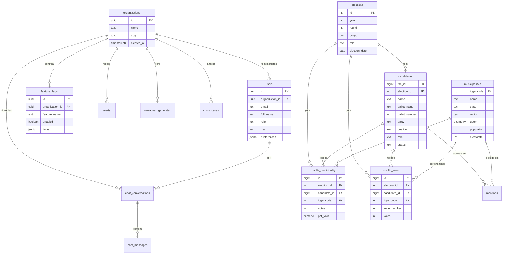

# Data Model — elleito.ai

Este documento descreve o schema Postgres (Supabase) do elleito.ai. Ele é a **fonte da verdade** do modelo de dados e deve estar sempre sincronizado com as migrations em `/supabase/migrations/`.

> Este schema reflete as decisões **[ADR-001](./docs/DECISIONS_LOG.md#adr-001)**, **[ADR-002](./docs/DECISIONS_LOG.md#adr-002)** e **[ADR-003](./docs/DECISIONS_LOG.md#adr-003)**.

## Princípios

1. **Nomes em inglês** no schema; labels em português apenas na camada de UI
2. **IDs oficiais como chave natural** onde fazem sentido: código IBGE para municípios, `sq_candidato` (TSE) para candidatos
3. **UUID** para entidades próprias do produto (organizações, usuários, feature flags, conversas)
4. **Snake_case** consistente
5. **Timestamps `timestamptz`** em todas as tabelas via trigger `set_updated_at()`
6. **Soft delete** em `users` e `organizations` (`deleted_at`); demais tabelas são imutáveis ou truncadas por ETL
7. **Dados pessoais sensíveis de candidatos NÃO são persistidos** (ver ADR-002)

## Visão geral



---

## Tabelas (detalhe)

### `organizations` (ADR-003)

Agrupa usuários pertencentes a um mesmo mandato, campanha, gabinete ou diretório partidário.

| Coluna | Tipo | Descrição |
|--------|------|-----------|
| `id` | `uuid` PK | — |
| `name` | `text` NOT NULL | Nome legível (ex.: "Gabinete Deputado X") |
| `slug` | `text` UNIQUE NOT NULL | Identificador curto para URLs |
| `billing_email` | `text` | Contato financeiro |
| `created_at` / `updated_at` / `deleted_at` | `timestamptz` | Auditoria + soft delete |

---

### `users`

Estende `auth.users` do Supabase com metadados do produto. **Não contém dados pessoais sensíveis além do necessário para operar a conta.**

| Coluna | Tipo | Descrição |
|--------|------|-----------|
| `id` | `uuid` PK | FK → `auth.users.id` |
| `organization_id` | `uuid` FK NOT NULL | Organização à qual pertence |
| `email` | `text` UNIQUE NOT NULL | — |
| `full_name` | `text` | — |
| `role` | `text` NOT NULL | `owner` \| `admin` \| `analyst` \| `viewer` |
| `plan` | `text` | **Campo livre** (ADR-003) — apenas classificação comercial, não usado em RLS |
| `preferences` | `jsonb` | UI (tema, filtros padrão) |
| `onboarded_at` | `timestamptz` | Quando completou onboarding |
| `created_at` / `updated_at` / `deleted_at` | `timestamptz` | — |

---

### `feature_flags` (ADR-003)

Liberação granular de features por organização. Substitui o gating por plano.

| Coluna | Tipo | Descrição |
|--------|------|-----------|
| `id` | `uuid` PK | — |
| `organization_id` | `uuid` FK NOT NULL | |
| `feature_name` | `text` NOT NULL | Ex.: `chat_copilot`, `mentions_monitor`, `trends_alerts` |
| `enabled` | `boolean` DEFAULT `false` | |
| `limits` | `jsonb` | Ex.: `{"monthly_queries": 500}` |
| `created_at` / `updated_at` | `timestamptz` | |

Constraint: `UNIQUE (organization_id, feature_name)`.

A lista canônica de nomes válidos é mantida em código (enum TypeScript compartilhado entre web e Edge Functions).

---

### `elections`

Dimensão central: uma linha por (ano, turno, escopo, cargo).

| Coluna | Tipo | Descrição |
|--------|------|-----------|
| `id` | `serial` PK | |
| `year` | `int` NOT NULL | Ex.: 2022 |
| `round` | `int` NOT NULL | 1 ou 2 |
| `scope` | `text` NOT NULL | `federal` \| `estadual` \| `municipal` |
| `role` | `text` NOT NULL | `presidente` \| `governador` \| `senador` \| `deputado_federal` \| `deputado_estadual` \| `prefeito` \| `vereador` |
| `election_date` | `date` NOT NULL | |
| `created_at` / `updated_at` | `timestamptz` | |

Constraint: `UNIQUE (year, round, scope, role)`.

---

### `candidates` (ADR-002)

Todos os candidatos vinculados a uma eleição. **Não armazena CPF, data de nascimento, bens, endereço, escolaridade, ocupação, raça ou gênero** (ADR-002).

| Coluna | Tipo | Descrição |
|--------|------|-----------|
| `tse_id` | `bigint` PK | `SQ_CANDIDATO` — chave natural do TSE |
| `election_id` | `int` FK → `elections.id` | |
| `name` | `text` NOT NULL | Nome completo |
| `ballot_name` | `text` | Nome de urna |
| `ballot_number` | `int` | Número na urna |
| `party` | `text` | Sigla do partido |
| `coalition` | `text` | Coligação |
| `role` | `text` NOT NULL | Cargo disputado (deve bater com `elections.role`) |
| `status` | `text` | `deferido` \| `indeferido` \| `renuncia` \| `falecido` \| `outros` |
| `created_at` / `updated_at` | `timestamptz` | |

Índices: `(election_id)`, `(party)`, `(role)`, GIN (`name` via `pg_trgm`) para busca textual.

---

### `municipalities`

Dimensão geográfica. No MVP: apenas 399 municípios do Paraná.

| Coluna | Tipo | Descrição |
|--------|------|-----------|
| `ibge_code` | `int` PK | Código IBGE (7 dígitos) |
| `tse_code` | `int` | Código TSE (para joins com resultados) |
| `name` | `text` NOT NULL | |
| `state` | `text` NOT NULL | Inicialmente `PR` |
| `region` | `text` | Mesorregião IBGE |
| `micro_region` | `text` | Microrregião IBGE |
| `geom` | `geometry(MultiPolygon, 4326)` | Geometria (PostGIS) |
| `centroid` | `geometry(Point, 4326)` | Para pins/labels |
| `area_km2` | `numeric` | |
| `population` | `int` | Censo mais recente |
| `electorate` | `int` | TSE mais recente |
| `gdp_per_capita` | `numeric` | IBGE (opcional Fase 1) |
| `idh` | `numeric` | PNUD (opcional Fase 1) |
| `created_at` / `updated_at` | `timestamptz` | |

Requer extensão **PostGIS**. Índice GiST em `geom` e `centroid`.

---

### `results_municipality`

Resultados agregados por município. Uma linha por (eleição × candidato × município).

| Coluna | Tipo | Descrição |
|--------|------|-----------|
| `id` | `bigserial` PK | |
| `election_id` | `int` FK | |
| `candidate_id` | `bigint` FK → `candidates.tse_id` | |
| `ibge_code` | `int` FK → `municipalities.ibge_code` | |
| `votes` | `int` NOT NULL | Votos nominais |
| `pct_valid` | `numeric(6,3)` | % sobre votos válidos |
| `pct_total` | `numeric(6,3)` | % sobre total (incl. brancos/nulos) |
| `rank_in_municipality` | `int` | Posição no município |
| `created_at` / `updated_at` | `timestamptz` | |

Constraint: `UNIQUE (election_id, candidate_id, ibge_code)`.  
Índices: `(election_id, ibge_code)`, `(candidate_id)`.

---

### `results_zone`

Granularidade fina por zona eleitoral.

| Coluna | Tipo | Descrição |
|--------|------|-----------|
| `id` | `bigserial` PK | |
| `election_id` | `int` FK | |
| `candidate_id` | `bigint` FK | |
| `ibge_code` | `int` FK | |
| `zone_number` | `int` NOT NULL | |
| `section_count` | `int` | Seções na zona |
| `votes` | `int` NOT NULL | |
| `electorate` | `int` | Eleitores aptos |
| `created_at` / `updated_at` | `timestamptz` | |

Constraint: `UNIQUE (election_id, candidate_id, ibge_code, zone_number)`.

---

## Tabelas de fases 3–6 (produtos de IA)

Os schemas abaixo são a **fonte da verdade** do modelo. As migrations correspondentes são criadas quando cada fase começa (ver [ROADMAP.md](./ROADMAP.md)). Design antecipado garante coerência entre pilares — p.ex. `crisis_cases` e `narratives_generated` compartilham `organization_id` e são usados no RAG do copiloto.

| Tabela | Fase | Pilar |
|--------|------|-------|
| `chat_conversations` / `chat_messages` | 3 | 2 — Chat |
| `regional_context` (pgvector) | 3 | 2 — Chat (RAG) |
| `mentions` | 4 | 3/4/5 (alimenta vários) |
| `alerts` | 5 | 3 — Tendências |
| `narratives_generated` | 6 | 4 — Narrativas |
| `crisis_cases` | 6 | 5 — Crise |
| `audit_log` | 7 | Admin/LGPD |

---

### `chat_conversations` / `chat_messages` (Fase 3)

**`chat_conversations`**

| Coluna | Tipo | Descrição |
|--------|------|-----------|
| `id` | `uuid` PK | |
| `organization_id` | `uuid` FK → `organizations.id` | Escopo RLS |
| `user_id` | `uuid` FK → `users.id` | |
| `title` | `text` | Resumo curto gerado por LLM |
| `context` | `jsonb` | Filtros fixados (eleição, região) |
| `created_at` / `updated_at` | `timestamptz` | |

**`chat_messages`**

| Coluna | Tipo | Descrição |
|--------|------|-----------|
| `id` | `uuid` PK | |
| `conversation_id` | `uuid` FK | |
| `role` | `text` | `user` \| `assistant` \| `tool` |
| `content` | `text` | |
| `tool_calls` | `jsonb` | Nome da tool + args + resultado |
| `tokens_in` / `tokens_out` | `int` | |
| `cost_usd` | `numeric(10,5)` | |
| `latency_ms` | `int` | |
| `prompt_version` | `text` | Ex.: `chat/v3` — ver `/prompts` |
| `created_at` | `timestamptz` | |

---

### `regional_context` (Fase 3 — pgvector)

Base de conhecimento regional do Paraná (notas curadas sobre microrregiões, lideranças, pautas sensíveis). **Alimenta o RAG do chat e de narrativas/crise.**

| Coluna | Tipo | Descrição |
|--------|------|-----------|
| `id` | `uuid` PK | |
| `region_level` | `text` | `meso` \| `micro` \| `municipio` |
| `region_key` | `text` | Nome da mesorregião, ou `ibge_code` serializado |
| `title` | `text` | Título do trecho |
| `content` | `text` NOT NULL | Conteúdo em prosa |
| `tags` | `text[]` | Tópicos cobertos |
| `source` | `text` | Quem escreveu/validou |
| `embedding` | `vector(1536)` | Indexado via `ivfflat` ou `hnsw` |
| `created_at` / `updated_at` | `timestamptz` | |

Índice vetorial: `create index on regional_context using hnsw (embedding vector_cosine_ops)`.

Requer extensão **`vector`** (pgvector — habilitada na Fase 3, não antes).

---

### `mentions` (Fase 4)

Menções em imprensa regional, redes sociais e blogs, já classificadas pelo Claude Haiku. **Dado público** — sem restrição RLS por organização.

| Coluna | Tipo | Descrição |
|--------|------|-----------|
| `id` | `uuid` PK | |
| `source_type` | `text` | `press` \| `social` \| `blog` \| `official` |
| `source_name` | `text` | Nome do veículo/perfil |
| `url` | `text` UNIQUE | URL canônica |
| `author` | `text` | Autor / handle |
| `title` | `text` | |
| `content` | `text` | Corpo extraído |
| `content_tsv` | `tsvector` GENERATED | Full-text PT-BR |
| `published_at` | `timestamptz` | Data da publicação |
| `ibge_code` | `int` FK NULL | Município se detectado |
| `region` | `text` | Mesorregião detectada |
| `candidate_tse_id` | `bigint` FK NULL | Candidato se detectado |
| `sentiment` | `text` | `positive` \| `neutral` \| `negative` |
| `sentiment_score` | `numeric(4,3)` | -1.000 a 1.000 |
| `entities` | `jsonb` | `[{type, name, confidence}]` |
| `topics` | `text[]` | Tópicos atribuídos |
| `hash` | `text` UNIQUE | SHA-256 do conteúdo (dedup) |
| `classifier_version` | `text` | Versão do prompt Haiku usado |
| `created_at` | `timestamptz` | |

Índices: GIN (`content_tsv`), `(published_at DESC)`, `(region, published_at DESC)`, `(candidate_tse_id, published_at DESC)`, GIN (`topics`).

---

### `alerts` (Fase 5)

Alertas de tendência gerados automaticamente pelo `trends_detector`.

| Coluna | Tipo | Descrição |
|--------|------|-----------|
| `id` | `uuid` PK | |
| `organization_id` | `uuid` FK | Org destinatária (escopo RLS) |
| `topic` | `text` NOT NULL | Tópico emergente |
| `region` | `text` | Mesorregião/microrregião detectada |
| `baseline_mentions_per_day` | `numeric` | Média da janela de 30d |
| `current_mentions_24h` | `int` | Contagem na janela recente |
| `growth_pct` | `numeric` | % de crescimento vs baseline |
| `sentiment_dominant` | `text` | `positive` \| `neutral` \| `negative` |
| `top_actors` | `text[]` | Pessoas/entidades mais citadas |
| `top_channels` | `text[]` | Veículos/perfis origem |
| `projected_reach` | `text` | Categórico: `local` \| `regional` \| `estadual` |
| `action_window_hours` | `int` | Janela crítica estimada |
| `analysis` | `text` | Sumário do Claude Sonnet |
| `recommendation` | `text` | Recomendação inicial |
| `prompt_version` | `text` | Ex.: `alerts/v2` |
| `status` | `text` NOT NULL DEFAULT `'new'` | `new` \| `seen` \| `in_progress` \| `resolved` \| `dismissed` |
| `actions_taken` | `jsonb` | Histórico de ações registradas pelo usuário |
| `notified_at` | `timestamptz` | Quando a notificação foi enviada |
| `notification_channels` | `text[]` | `email`, `whatsapp`, `in_app` |
| `created_at` / `updated_at` | `timestamptz` | |

Índice: `(organization_id, created_at DESC)`, `(status)`.

---

### `narratives_generated` (Fase 6 — Pilar 4)

Histórico de narrativas geradas e seu resultado real quando reportado pelo cliente. **Alimenta o RAG** — quanto mais uso, mais ancorado o produto fica.

| Coluna | Tipo | Descrição |
|--------|------|-----------|
| `id` | `uuid` PK | |
| `organization_id` | `uuid` FK | Escopo RLS |
| `user_id` | `uuid` FK | Quem gerou |
| `input_context` | `text` NOT NULL | Descrição da situação |
| `input_region` | `text` | |
| `input_profile` | `jsonb` | Partido, cargo, posicionamento |
| `input_objective` | `text` | |
| `output_narratives` | `jsonb` NOT NULL | Array de 3 narrativas + recomendação + riscos |
| `selected_narrative` | `int` | Índice (0-2) da escolha do cliente |
| `action_taken` | `text` | O que o cliente de fato fez |
| `real_outcome` | `text` | Resultado observado (opcional, preenchido depois) |
| `outcome_rating` | `int` | 1–5 — auto-avaliação do cliente |
| `prompt_version` | `text` | Ex.: `narratives/v1` |
| `embedding` | `vector(1536)` NULL | Para RAG em gerações futuras |
| `created_at` / `updated_at` | `timestamptz` | |

---

### `crisis_cases` (Fase 6 — Pilar 5)

Histórico de crises analisadas. Compartilha a mesma lógica de `narratives_generated` (input estruturado → output estruturado → resultado real).

| Coluna | Tipo | Descrição |
|--------|------|-----------|
| `id` | `uuid` PK | |
| `organization_id` | `uuid` FK | Escopo RLS |
| `user_id` | `uuid` FK | |
| `input_problem` | `text` NOT NULL | Descrição da crise |
| `input_category` | `text` | `administrativa` \| `pessoal` \| `politica` \| `imprensa` \| `judicial` \| `redes_sociais` |
| `input_actor` | `text` | `oposicao` \| `imprensa` \| `cidadao` \| `orgao_controle` \| `ex_aliado` |
| `input_main_channel` | `text` | Canal principal de propagação |
| `input_reach` | `text` | Alcance estimado `baixo`\|`medio`\|`alto` |
| `input_position` | `jsonb` | Cliente: posição política + histórico |
| `diagnosis_severity` | `text` | `baixa` \| `media` \| `alta` \| `critica` |
| `diagnosis_vector` | `text` | Vetor de expansão |
| `diagnosis_window_hours` | `int` | Janela de ação estimada |
| `output_scenarios` | `jsonb` NOT NULL | 3 cenários (assertiva, conciliadora, silêncio) com roteiro/canal/timing/riscos |
| `recommendation` | `text` | Cenário recomendado + justificativa |
| `followup_plan` | `jsonb` | Checkpoints 24h / 48h / 72h |
| `selected_scenario` | `int` | 0-2 |
| `action_taken` | `text` | O que foi feito |
| `real_outcome` | `text` | Resultado observado |
| `outcome_rating` | `int` | 1–5 |
| `prompt_version` | `text` | Ex.: `crisis/v1` |
| `embedding` | `vector(1536)` NULL | RAG |
| `created_at` / `updated_at` | `timestamptz` | |

Documentação detalhada do fluxo: [docs/CRISIS_FLOW.md](./docs/CRISIS_FLOW.md).

---

### `audit_log` (Fase 7)

Auditoria de ações administrativas e operações sensíveis (LGPD/compliance).

| Coluna | Tipo | Descrição |
|--------|------|-----------|
| `id` | `bigserial` PK | |
| `actor_id` | `uuid` FK → `users.id` NULL | Null em ações do sistema |
| `organization_id` | `uuid` FK NULL | |
| `action` | `text` NOT NULL | Ex.: `user.deleted`, `export.generated` |
| `target_type` | `text` | Tabela/entidade afetada |
| `target_id` | `text` | PK da entidade |
| `metadata` | `jsonb` | Payload completo |
| `ip` | `inet` | IP da origem |
| `user_agent` | `text` | |
| `created_at` | `timestamptz` | |

---

## Views úteis

- `v_municipality_summary(ibge_code, year)` — votos totais, eleitorado e top partidos por município em um ano
- `v_party_evolution(party, role)` — evolução de votos de um partido ao longo dos anos
- `v_election_catalog` — lista enxuta de eleições com contagem de candidatos e municípios cobertos

---

## Row Level Security (políticas — ADR-003)

**Regra geral:**

1. **Dados eleitorais públicos** (`elections`, `candidates`, `municipalities`, `results_*`) são visíveis a qualquer usuário autenticado — são dados públicos do TSE/IBGE.
2. **Menções** (`mentions`) também são dados públicos — sem escopo por organização.
3. **Dados de conta e de inteligência estratégica** (`users`, `chat_*`, `alerts`, `narratives_generated`, `crisis_cases`) são escopados por `organization_id`.
4. **Feature flags e contexto regional** (`feature_flags`, `regional_context`) — flags por organização; `regional_context` legível por qualquer autenticado (é base de conhecimento compartilhada).

```sql
-- users: enxerga a si mesmo + colegas da mesma organização
CREATE POLICY users_same_org ON users FOR SELECT
  USING (
    organization_id = (
      SELECT organization_id FROM users WHERE id = auth.uid()
    )
  );

-- feature_flags: apenas da própria organização
CREATE POLICY feature_flags_same_org ON feature_flags FOR SELECT
  USING (
    organization_id = (
      SELECT organization_id FROM users WHERE id = auth.uid()
    )
  );

-- dados eleitorais: qualquer autenticado pode ler
CREATE POLICY elections_read_auth ON elections FOR SELECT
  TO authenticated USING (true);
-- (análogo para candidates, municipalities, results_municipality, results_zone)
```

Gating de features (ex.: quem pode usar o chat copiloto) é feito **no nível da aplicação** consultando `feature_flags`, não no SQL.

---

## Extensões Postgres

Habilitadas na **Fase 1** (migration `20260421120000_extensions.sql`):

- `postgis` — geometrias municipais
- `pg_trgm` — busca aproximada em nomes
- `unaccent` — busca insensível a acentos
- `pgcrypto` — UUIDs (`gen_random_uuid()`)

Habilitadas em fases posteriores:

- `vector` (pgvector) — **Fase 3**, para embeddings em `regional_context` (chat RAG) e posteriormente em `narratives_generated` / `crisis_cases` (Fase 6)

---

## Migrations

Tudo em `/supabase/migrations/` com naming `YYYYMMDDHHMMSS_descricao.sql`. Alterações de schema vão sempre via migration + `supabase db push`. Produção é atualizada após aprovação manual.
