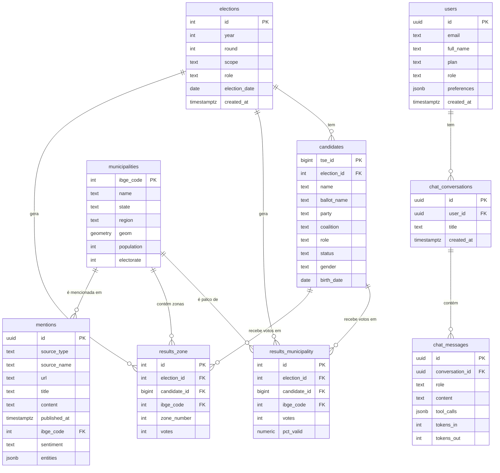

# Data Model — elleito.ai

Este documento descreve o schema proposto do banco Postgres (Supabase) para o MVP. O foco é **clareza**, **integridade referencial** e **aderência ao modelo de dados do TSE**.

## Princípios

1. **Nomes em inglês** no schema (tabela, coluna), **labels em português** na camada de UI
2. **IDs oficiais como chave natural** onde possível: código IBGE para municípios, número TSE para candidatos
3. **Surrogate keys (`uuid`)** para as entidades próprias do produto (usuários, menções, conversas)
4. **Snake_case** consistente
5. **Timestamps `timestamptz`** em todas as tabelas (`created_at`, `updated_at`)
6. **Soft delete** apenas em `users` (via `deleted_at`); demais tabelas são imutáveis ou truncadas por ETL

## Schema (alto nível)



---

## Tabelas (detalhe)

### `elections`
Dimensão central: uma linha por (ano, turno, cargo) eleitoral.

| Coluna | Tipo | Descrição |
|--------|------|-----------|
| `id` | `serial` PK | ID interno |
| `year` | `int` | Ano da eleição (ex.: 2022) |
| `round` | `int` | Turno: 1 ou 2 |
| `scope` | `text` | `federal` \| `estadual` \| `municipal` |
| `role` | `text` | `presidente` \| `governador` \| `senador` \| `deputado_federal` \| `deputado_estadual` \| `prefeito` \| `vereador` |
| `election_date` | `date` | Data oficial do pleito |
| `created_at` / `updated_at` | `timestamptz` | Auditoria |

Constraint: `UNIQUE (year, round, scope, role)`.

---

### `candidates`
Todos os candidatos vinculados a uma eleição específica. Mesmo candidato em anos diferentes = linhas diferentes.

| Coluna | Tipo | Descrição |
|--------|------|-----------|
| `tse_id` | `bigint` PK | Número sequencial TSE (SQ_CANDIDATO) |
| `election_id` | `int` FK → `elections.id` | Eleição |
| `cpf` | `text` | CPF (encryption at rest via Supabase Vault) |
| `name` | `text` | Nome civil |
| `ballot_name` | `text` | Nome de urna |
| `ballot_number` | `int` | Número na urna |
| `party` | `text` | Sigla do partido |
| `coalition` | `text` | Coligação |
| `role` | `text` | Cargo disputado |
| `status` | `text` | `deferido` \| `indeferido` \| `renuncia` \| `falecido` |
| `gender` | `text` | Autodeclaração de gênero |
| `race` | `text` | Autodeclaração de cor/raça |
| `birth_date` | `date` | Data de nascimento |
| `education` | `text` | Escolaridade |
| `occupation` | `text` | Ocupação declarada |
| `declared_assets` | `numeric` | Bens declarados em R$ |
| `created_at` / `updated_at` | `timestamptz` | — |

Índices: `(election_id)`, `(party)`, `(role)`, GIN em `name` para busca textual.

---

### `municipalities`
399 municípios do Paraná (dimensão geográfica). Será possível expandir para outros estados no futuro.

| Coluna | Tipo | Descrição |
|--------|------|-----------|
| `ibge_code` | `int` PK | Código IBGE (7 dígitos) |
| `tse_code` | `int` | Código TSE (para joins com resultados) |
| `name` | `text` | Nome do município |
| `state` | `text` | UF (inicialmente `PR`) |
| `region` | `text` | Mesorregião IBGE |
| `micro_region` | `text` | Microrregião IBGE |
| `geom` | `geometry(MultiPolygon, 4326)` | Geometria (PostGIS) |
| `centroid` | `geometry(Point, 4326)` | Centroide para pins |
| `area_km2` | `numeric` | Área em km² |
| `population` | `int` | População (censo mais recente) |
| `electorate` | `int` | Eleitores (TSE mais recente) |
| `gdp_per_capita` | `numeric` | PIB per capita (IBGE) |
| `idh` | `numeric` | IDH (PNUD) |

Requer extensão **PostGIS**. Índice GiST em `geom`.

---

### `results_municipality`
Resultados agregados por município. Uma linha por (eleição × candidato × município).

| Coluna | Tipo | Descrição |
|--------|------|-----------|
| `id` | `bigserial` PK | — |
| `election_id` | `int` FK → `elections.id` | |
| `candidate_id` | `bigint` FK → `candidates.tse_id` | |
| `ibge_code` | `int` FK → `municipalities.ibge_code` | |
| `votes` | `int` | Votos nominais |
| `pct_valid` | `numeric(6,3)` | % sobre votos válidos |
| `pct_total` | `numeric(6,3)` | % sobre total (incl. brancos/nulos) |
| `rank_in_municipality` | `int` | Posição no município |
| `created_at` / `updated_at` | `timestamptz` | — |

Constraint: `UNIQUE (election_id, candidate_id, ibge_code)`.  
Índices: `(election_id, ibge_code)`, `(candidate_id)`.

---

### `results_zone`
Resultados por zona eleitoral (granularidade fina). Uma linha por (eleição × candidato × município × zona).

| Coluna | Tipo | Descrição |
|--------|------|-----------|
| `id` | `bigserial` PK | — |
| `election_id` | `int` FK | |
| `candidate_id` | `bigint` FK | |
| `ibge_code` | `int` FK | |
| `zone_number` | `int` | Número da zona eleitoral |
| `section_count` | `int` | Seções existentes na zona |
| `votes` | `int` | Votos nominais |
| `electorate` | `int` | Eleitores aptos |
| `created_at` / `updated_at` | `timestamptz` | — |

Constraint: `UNIQUE (election_id, candidate_id, ibge_code, zone_number)`.

---

### `mentions`
Menções em imprensa regional e redes sociais, já classificadas por LLM.

| Coluna | Tipo | Descrição |
|--------|------|-----------|
| `id` | `uuid` PK | — |
| `source_type` | `text` | `press` \| `social` \| `blog` \| `official` |
| `source_name` | `text` | Nome do veículo |
| `url` | `text` UNIQUE | URL canônica |
| `author` | `text` | Autor / perfil |
| `title` | `text` | Título |
| `content` | `text` | Corpo extraído |
| `content_tsv` | `tsvector` | Índice full-text PT-BR (GENERATED) |
| `published_at` | `timestamptz` | Data da publicação |
| `ibge_code` | `int` FK NULL | Município se detectado |
| `candidate_tse_id` | `bigint` FK NULL | Candidato se detectado |
| `sentiment` | `text` | `positive` \| `neutral` \| `negative` |
| `sentiment_score` | `numeric(4,3)` | -1.000 a 1.000 |
| `entities` | `jsonb` | `[{type, name, confidence}]` |
| `topics` | `text[]` | Tópicos atribuídos |
| `hash` | `text` UNIQUE | Hash do conteúdo (dedup) |
| `created_at` | `timestamptz` | — |

Índices: GIN em `content_tsv` (busca), `(published_at DESC)`, `(candidate_tse_id, published_at DESC)`.

---

### `users`
Usuários da plataforma (estende `auth.users` do Supabase).

| Coluna | Tipo | Descrição |
|--------|------|-----------|
| `id` | `uuid` PK | FK → `auth.users.id` |
| `email` | `text` UNIQUE | — |
| `full_name` | `text` | — |
| `organization` | `text` | Partido / equipe / gabinete |
| `role` | `text` | `admin` \| `owner` \| `analyst` \| `viewer` |
| `plan` | `text` | `free` \| `essential` \| `pro` \| `enterprise` |
| `preferences` | `jsonb` | UI (tema, filtros padrão) |
| `onboarded_at` | `timestamptz` | Quando completou onboarding |
| `created_at` / `updated_at` / `deleted_at` | `timestamptz` | Auditoria + soft delete |

RLS obrigatório: um usuário só vê a si mesmo, exceto quando `role = 'admin'`.

---

### `chat_conversations` e `chat_messages`

Histórico do chat copiloto.

**`chat_conversations`**

| Coluna | Tipo | Descrição |
|--------|------|-----------|
| `id` | `uuid` PK | |
| `user_id` | `uuid` FK → `users.id` | |
| `title` | `text` | Resumo curto gerado por LLM |
| `context` | `jsonb` | Filtros fixados (eleição, região) |
| `created_at` / `updated_at` | `timestamptz` | — |

**`chat_messages`**

| Coluna | Tipo | Descrição |
|--------|------|-----------|
| `id` | `uuid` PK | |
| `conversation_id` | `uuid` FK | |
| `role` | `text` | `user` \| `assistant` \| `tool` |
| `content` | `text` | Texto |
| `tool_calls` | `jsonb` | Nome da tool + args + resultado |
| `tokens_in` / `tokens_out` | `int` | Consumo |
| `cost_usd` | `numeric(10,5)` | Custo estimado |
| `latency_ms` | `int` | Tempo de resposta |
| `created_at` | `timestamptz` | — |

---

## Views úteis

- `v_municipality_summary(ibge_code)` — agrega votos totais, eleitorado e ranking de partidos por município
- `v_party_evolution(party, role)` — evolução de votos de um partido ao longo dos anos
- `v_candidate_history(tse_id)` — todas as eleições disputadas por um mesmo CPF

## Row Level Security (políticas)

```sql
-- users: só vê a si mesmo
CREATE POLICY users_self ON users
  FOR SELECT USING (auth.uid() = id);

-- chat: só vê suas próprias conversas
CREATE POLICY chat_own ON chat_conversations
  FOR ALL USING (auth.uid() = user_id);

-- tabelas eleitorais: leitura conforme plano
CREATE POLICY results_by_plan ON results_municipality
  FOR SELECT USING (
    EXISTS (
      SELECT 1 FROM users
      WHERE users.id = auth.uid()
      AND users.plan IN ('essential','pro','enterprise')
    )
  );
```

## Extensões Postgres necessárias

- `postgis` — geometrias municipais
- `pg_trgm` — busca aproximada em nomes
- `unaccent` — busca insensível a acentos
- `pgcrypto` — UUIDs e hash
- `vector` (opcional, Fase 4+) — embeddings de menções para busca semântica

## Migrations

Todas as alterações de schema ficam em `/supabase/migrations/` com naming `YYYYMMDDHHMM_descricao.sql`. Nada de alterações manuais em produção — tudo via `supabase db push`.
