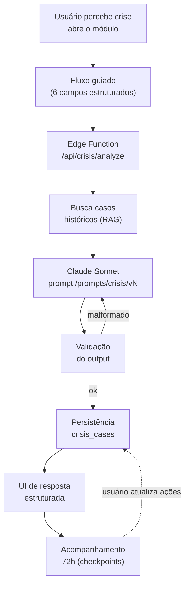

# Crisis Flow — Pilar 5: Contenção de Crise

Este documento especifica em detalhe o fluxo de trabalho da feature de **contenção de crise** — o pilar 5 do elleito.ai, considerado o de **maior valor percebido** pelo cliente.

> Ver também: [PROJECT.md#pilar-5--contenção-de-crise](../PROJECT.md), tabela `crisis_cases` em [DATA_MODEL.md](../DATA_MODEL.md), prompt em `/prompts/crisis/`.

## Objetivo

Permitir que um mandatário, campanha ou consultor, ao perceber o início de uma crise política, obtenha em **menos de 90 segundos** um diagnóstico estruturado e três cenários de resposta acionáveis — em vez de esperar a próxima reunião com a assessoria.

## Diagrama do fluxo



## Inputs (estrutura exata)

O fluxo guiado apresenta **um passo por vez**, nunca um formulário grande.

| Campo | Tipo | Descrição | Obrigatório |
|-------|------|-----------|-------------|
| `problem` | `text` (5–1000 chars) | Descrição em texto livre do que está acontecendo | Sim |
| `category` | `enum` | `administrativa` \| `pessoal` \| `politica` \| `imprensa` \| `judicial` \| `redes_sociais` | Sim |
| `actor` | `enum` | `oposicao` \| `imprensa` \| `cidadao` \| `orgao_controle` \| `ex_aliado` \| `desconhecido` | Sim |
| `main_channel` | `text` | Canal principal onde a crise se propaga (ex.: "rádio local", "TikTok", "câmara municipal") | Sim |
| `estimated_reach` | `enum` | `baixo` (centenas) \| `medio` (milhares) \| `alto` (dezenas de milhares) | Sim |
| `client_position` | `object` | `{party, role, current_office, recent_record[]}` — perfil do cliente | Sim |

Payload final enviado à Edge Function:

```json
{
  "organization_id": "uuid",
  "problem": "Vídeo circulando no WhatsApp acusa o prefeito de fechar posto de saúde em bairro periférico",
  "category": "administrativa",
  "actor": "cidadao",
  "main_channel": "WhatsApp + Facebook local",
  "estimated_reach": "medio",
  "client_position": {
    "party": "MDB",
    "role": "prefeito",
    "current_office": "Prefeitura de União da Vitória",
    "recent_record": ["inauguração de UBS em março", "aumento de vagas em creche"]
  }
}
```

## Processamento

1. **Validação do input** (zod/pydantic no backend) — campos obrigatórios, enums válidos, tamanho dentro do limite.
2. **RAG de casos comparáveis**: busca em `crisis_cases` por similaridade vetorial (pgvector sobre `embedding` do `input_problem`) filtrando por `category` e, se possível, região próxima.
3. **Composição do prompt** (`/prompts/crisis/vN.md`): system prompt fixo + injeção de casos comparáveis + input atual.
4. **Chamada ao Claude Sonnet** com `response_format` JSON estruturado (via tool use obrigatório).
5. **Validação do output** contra o schema esperado. Malformado → retry 1x com prompt de correção; se falhar de novo, erro visível ao usuário (sem fallback silencioso).
6. **Persistência** em `crisis_cases`.
7. **Resposta à UI** com renderização estruturada.

## Output (estrutura exata)

Schema JSON esperado da resposta do modelo:

```json
{
  "diagnosis": {
    "severity": "baixa | media | alta | critica",
    "vector": "texto curto descrevendo o vetor de expansão",
    "window_hours": 48,
    "reasoning": "explicação de 2-3 linhas do diagnóstico"
  },
  "scenarios": [
    {
      "id": "assertiva",
      "title": "Resposta assertiva direta",
      "script": "Texto pronto para publicação/entrevista, em 1ª pessoa",
      "channels": ["coletiva de imprensa", "post no Instagram"],
      "timing": "nas próximas 12h",
      "risks": ["pode parecer defensivo", "amplifica o alcance"]
    },
    {
      "id": "conciliadora",
      "title": "Resposta conciliadora",
      "script": "...",
      "channels": [...],
      "timing": "...",
      "risks": [...]
    },
    {
      "id": "silencio_estrategico",
      "title": "Silêncio público + ação de campo",
      "script": "Não há comunicação pública. Em paralelo: ...",
      "channels": ["ações de campo", "comunicação 1-a-1 com líderes locais"],
      "timing": "iniciar hoje, reavaliar em 72h",
      "risks": ["crítico interpretar silêncio como admissão"]
    }
  ],
  "recommendation": {
    "scenario_id": "conciliadora",
    "justification": "Dado que o ator é cidadão comum e a categoria é administrativa, uma resposta direta e com evidências do histórico recente tende a..."
  },
  "followup_plan": {
    "checkpoints": [
      {"at_hours": 24, "action": "verificar se o volume de menções caiu, revisar sentimento"},
      {"at_hours": 48, "action": "avaliar se oposição formal reagiu; se sim, preparar segunda onda"},
      {"at_hours": 72, "action": "decisão: encerrar, escalar para comunicado oficial, ou mudar cenário"}
    ]
  },
  "prompt_version": "crisis/v1"
}
```

## Estados no banco (`crisis_cases`)

- Após análise inicial: todos os campos `input_*`, `diagnosis_*`, `output_scenarios`, `recommendation`, `followup_plan`, `prompt_version` preenchidos.
- Após cliente escolher um cenário: `selected_scenario` (0-2).
- Após execução: `action_taken` (texto livre do que foi feito).
- Dias/semanas depois: `real_outcome` + `outcome_rating` (1–5) — **feedback fecha o ciclo e alimenta o RAG futuro**.

## Prompt base

Armazenado em `/prompts/crisis/v1.md`. Princípios:

- **Papel**: "Você é um estrategista político brasileiro especializado em gestão de crise, com 20 anos de experiência assessorando mandatos no interior do país."
- **Instruções estruturais**: "Responda estritamente no schema JSON abaixo. Não adicione comentários fora do JSON."
- **Guardrails**: "Não sugira mentiras. Não sugira ações ilegais. Marque explicitamente no campo `risks` qualquer consequência legal, moral ou reputacional."
- **Contexto regional**: injetado via RAG antes da chamada.

## Métricas de sucesso

| Métrica | Alvo |
|---------|------|
| Tempo de diagnóstico (input completo → resposta renderizada) | < 90s |
| Taxa de output JSON válido na primeira tentativa | > 95% |
| NPS da feature com primeiros 5 clientes piloto | ≥ 60 |
| Cenário recomendado efetivamente escolhido pelo cliente | > 50% (sinal de confiança) |
| `outcome_rating` médio (quando preenchido) | ≥ 3,5 / 5 |

## Anti-padrões

- ❌ Colocar todos os campos em um formulário único gigante — o fluxo guiado existe para dar foco
- ❌ Aceitar texto livre onde cabe enum — aumenta variância no prompt
- ❌ Prometer "previsão" de resultado — o produto informa caminhos, não profetiza
- ❌ Gerar scripts de resposta que fazem afirmações factuais não verificadas
