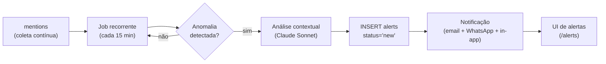

# Trends Detection — Pilar 3: Detector de Tendências com Alertas

Especificação do algoritmo de detecção de aceleração anômala de tópicos sobre a base `mentions`, da análise contextual automática que o acompanha, e do pipeline de notificações.

> Ver também: [PROJECT.md#pilar-3--detector-de-tendências-com-alertas](../PROJECT.md), tabela `alerts` em [DATA_MODEL.md](../DATA_MODEL.md), prompt em `/prompts/alerts/`.

## Princípio

Não é predição, é **detecção precoce com contexto acionável**. O sistema identifica que **algo está acelerando fora do normal** antes que a pauta vire crise regional, e entrega o alerta com análise pronta para decisão.

## Arquitetura resumida



## Entidade de trabalho: (tópico × região × janela)

O detector opera sobre combinações de:

- **Tópico**: atribuído pelo classificador de menções (`mentions.topics`). Ex.: `posto_de_saude`, `violencia_urbana`, `obras_atrasadas`.
- **Região**: mesorregião IBGE ou município específico (`mentions.region` / `ibge_code`).
- **Janela atual**: últimas **24 horas** (padrão; ajustável por organização).
- **Janela de baseline**: **30 dias** anteriores à janela atual.

## Cálculo do baseline

Para cada (tópico × região):

1. `baseline_mean = média de menções/dia nos últimos 30 dias (excluindo a janela atual)`
2. `baseline_stddev = desvio padrão nesses mesmos 30 dias`

Armazenados em uma materialização (tabela ou materialized view) atualizada a cada execução do job — não recalculamos do zero para todos os tópicos a cada ciclo.

## Disparador

Um alerta é disparado para `(tópico, região)` quando **todas** as condições abaixo valem:

1. `current_mentions_24h >= max(MIN_ABSOLUTE, baseline_mean * 1.5)`  
   — crescimento de **pelo menos 150%** sobre o baseline
2. `current_mentions_24h >= MIN_ABSOLUTE`  
   — valor absoluto mínimo (default: **10**) para evitar ruído em tópicos raros
3. **Não existe** alerta `status != 'dismissed'` ativo para o mesmo `(topic, region, organization)` criado nas últimas **24h**  
   — anti-spam

Parâmetros (`MIN_ABSOLUTE`, multiplicador de 1.5, janelas) são overridable por organização via `feature_flags.limits`.

## Análise contextual (após disparar)

Quando um alerta dispara, o job imediatamente chama o **Claude Sonnet** com o prompt `/prompts/alerts/vN.md` e contexto:

- Descrição do tópico + região
- Baseline vs janela atual
- Amostra de até 20 menções recentes relevantes
- Perfil da organização destinatária (para contextualizar recomendação)

O modelo retorna:

```json
{
  "sentiment_dominant": "negative",
  "top_actors": ["Prefeito de União da Vitória", "Vereador João"],
  "top_channels": ["Grupo Facebook 'União Unida'", "RIC Mais"],
  "projected_reach": "regional",
  "action_window_hours": 72,
  "analysis": "O tópico 'posto de saúde fechado' apareceu em 3 bairros distintos com narrativa convergente, sugerindo possível coordenação oposicionista...",
  "recommendation": "Verificar imediatamente o status operacional das UBSs citadas. Preparar comunicado oficial com dados de atendimento do último trimestre."
}
```

## Persistência (`alerts`)

Ver schema completo em [DATA_MODEL.md#alerts-fase-5](../DATA_MODEL.md).

Cada registro captura: métricas do disparador, saída do modelo, e campos de acompanhamento (`status`, `actions_taken`).

## Pipeline de notificações

Após o INSERT em `alerts`:

1. **In-app** (sempre): via Supabase Realtime — o painel `/alerts` da organização recebe push
2. **Email** (se habilitado em `feature_flags.alerts_email`): via provedor transacional
3. **WhatsApp** (se habilitado em `feature_flags.alerts_whatsapp`): via Zenvia ou WATI, para números validados

`notified_at` é gravado no momento do envio; `notification_channels` lista o que saiu.

## Cadência e custo

- Job roda a cada **15 min** (configurável)
- Na maioria dos ciclos, **nenhum alerta** é disparado (baseline estável)
- Quando dispara, **1 chamada Claude Sonnet por alerta** — custo marginal controlado
- Limite defensivo: no máximo **20 alertas/dia por organização** (configurável). Excedente é silenciado e logado.

## Backtest

Para validar calibração, fazemos backtest contra crises conhecidas do PR 2022–2024. Pipeline:

1. Recarregar `mentions` com data histórica (já coletadas ou sementes curadas)
2. Rodar o detector com `as_of_date` parametrizado
3. Verificar se o sistema teria disparado com a janela correta (antes da crise explodir publicamente)

Alvo: **> 70% de recall** em crises documentadas, **< 20% de falso-positivo** no período.

## Métricas em produção

| Métrica | Alvo |
|---------|------|
| Latência detecção → notificação | < 5 min |
| Taxa de falso-positivo (avaliação retrospectiva do usuário) | < 20% |
| `outcome_rating` médio dos alertas (feedback do cliente) | ≥ 3,5 / 5 |
| Custo médio por alerta (análise Sonnet) | < R$ 0,20 |

## Anti-padrões

- ❌ Multiplicador de disparo muito baixo → ruído constante, o usuário silencia tudo
- ❌ Alerta sem recomendação → só ansiedade, sem decisão
- ❌ Incluir métricas matemáticas sem narrativa → usuário não lê gráfico, lê texto
- ❌ Ignorar a dimensão regional → crise local falsamente classificada como ruído estatístico estadual
